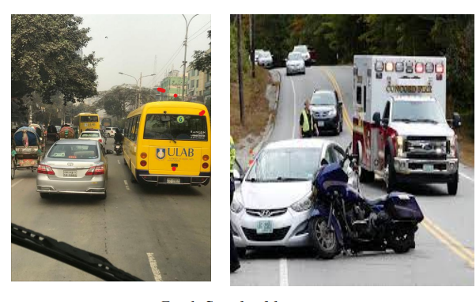
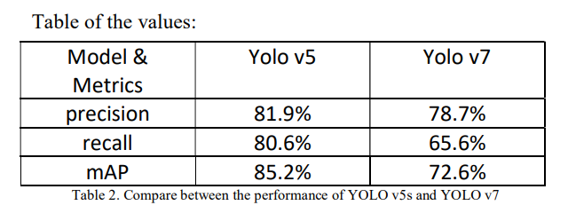
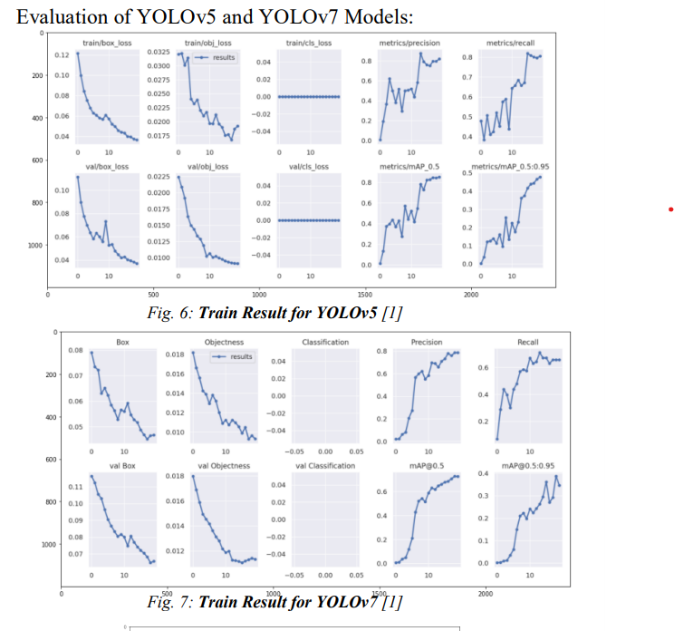
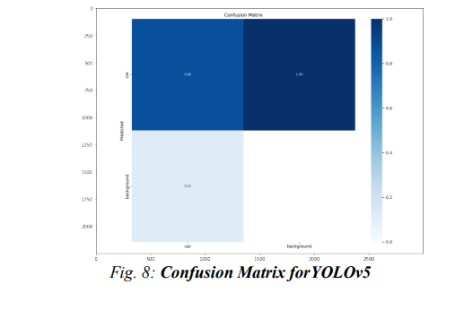
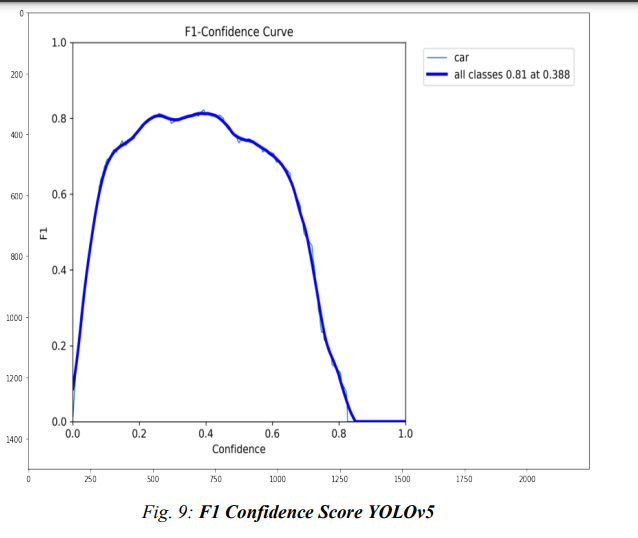
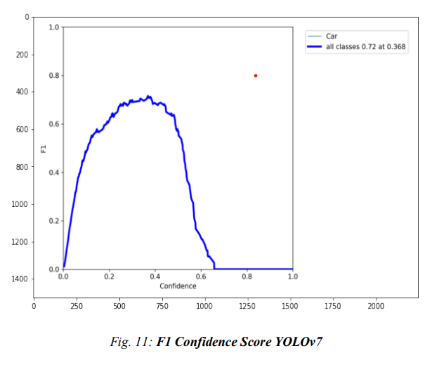

# Car-Detection-using-YOLO
**📖 Table of Contents**

 ➤ OverView

 ➤ DataSet

 ➤ Getting Started

  
**☁️ Overview** 

The mainobjective of this project is to train two models to detect cars
from various images, using a mixed dataset with varying
sources, camera angles, resolutions and backgrounds. We
have built a car detection system based on YOLOv5 and
YOLOv7.

**🔸 DataSet**

Collect Various Images from google and mixed datasets
with varying sources, Camera angles, resolutions and
background that contain other vehicles and multiple object.
The dataset contains 500 images that split to 70% training set
20% validation set and 10% testing set.
Preprocessing:
Auto Orient: Applied, 
Resize: Stretch to 640 x640. No
Augmentation applied. 
Implemented by Roboflow to label images. 
Roboflow support many annotate for instance Bounding box and Polygons. 
In our Case we choose Bounding box that a rectangle that surround a specific object

    
**⚙️Methods**
 we used these two different models 
YOLOv5s and YOLOv7 to compare the performance of the
model The code is implemented in Pytorch, an open source
machine learning framework that accelerates the path from
research prototyping to production deployment

**Result**

The dataset had been tested by these two models which
were YOLOv5s and YOLOv7. The car dataset was trained
for 20 epochs in two models. Key assets of the training
model were checked regularly which are: the loss function
value, precision, recall, mAP with default learning rate in
two models which was 0.01 in YOLO v5s and 0.01 and 0.1
in YOLO v7. All these values were improving to the end of
epochs. The model which achieved best performance was
YOLOv5.

 
 **Conclusion**
 
 The mAP@0.5 of the YOLOv5 and YOLOv7 model on the
training set of data was 85.2% and72.6% respectively
therefore the Yolov5 higher than Yolov7. the detection time
of the YOLOv5 model completed in 118800ms and
YOLOv7 completed in 295200ms. For validation set the
mAP@0.5 of the YOLOv5 and YOLOv7 84.6% and 72.2%
respectively so the YOLOv5 higher than YOLOv7.
The two models have missed or wrong detection therefore
the model should be optimized to improve the detection
accuracy by using high- resolution cameras for image
acquisition and increase the number of epochs to 3000
epochs. 
